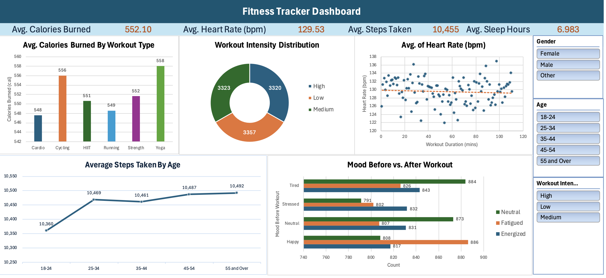

**<h1>Fitness Tracker Dashboard</h1>**

- Cleaned and analyzed large datasets using pivot tables and aggregate functions
- Developed interactive charts and tables to visualize workout trends and their correlation with various factors
- Implemented dynamic filters to adjust data trends based on gender, age group, and workout intensity
- Identified workout patterns to create customized fitness plan using Key Performance Indicators (KPIs)
